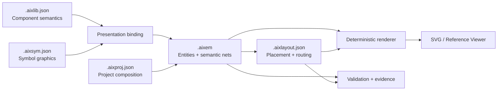

<div align="center">

# AIXEM

### AI-Native Schematic Authoring Reference Platform

**Semantic authority · deterministic authoring · source-bound parts · Agent-first workflows**

[](docs/releases/0.5.9.md)
[](validation/releases/0.5.9/final-validation.md)
[](validation/evidence/0.5.9/verification-runs/summary.json)
[](release/release-metadata.json)

<br/>

**AIXEM defines a machine-readable authority model for schematics that an AI Agent can author, place, route, render, and validate without inventing connectivity or semantic truth.**

</div>

---

## Why AIXEM?

Most schematic automation starts from graphics. AIXEM starts from **authority**.

| Principle | What it means |
|---|---|
| **Semantic-first** | Connectivity comes from explicit semantic nets and stable endpoint IDs — never visual proximity. |
| **Deterministic** | The same authoritative inputs produce the same placement guidance, render output, and validation evidence. |
| **Source-bound** | Concrete real-world parts must be backed by provenance, otherwise they remain explicit placeholders. |
| **Agent-native** | AI Agents navigate from task intent to bounded guides, routes, canonical specifications, validators, and evidence. |

> **A render is not electrical truth.** AIXEM deliberately separates structural validity, part semantics, bounded compatibility, and circuit-intent review.

---

## Architecture at a Glance



### Authority Model

| Artifact | Authority |
|---|---|
| `.aixlib.json` | Component identity, ports, properties, provenance, presentations |
| `.aixsym.json` | Reusable symbol geometry and visual endpoint presentation |
| `.aixem` | Schematic entities and semantic net membership |
| `.aixlayout.json` | Component placement and route geometry |
| `.aixproj.json` | Multi-sheet/project composition and digest closure |

Rendered SVG, Viewer state, task packets, diagnostics, placement suggestions, audits, and validation reports are **derived or evidentiary**. They do not redefine source authority.

---

## Agent Authoring Loop

```text
Task intent
    ↓
AGENTS.md / REFERENCE.md
    ↓
docs/authoring/guides/index.md
    ↓
task-specific guide + bounded route
    ↓
canonical specification
    ↓
authoritative source edit
    ↓
validator → render review → evidence
```

The Agent-facing guide layer covers:

`create-library-part` · `select-library-part` · `create-schematic` · `place-components` · `route-nets` · `compose-project` · `modify-existing-schematic` · `author-component-circuit` · `render-review` · `validate-project`

---

## 0.5.9 — Verified Authoring Hardening

AIXEM 0.5.9 focuses on making AI-authored schematics **less ambiguous, more reviewable, and more deterministic** without expanding into a simulator or global auto-layout system.

- canonical `library/electronics/...` and `library/architecture/...` authoring structure;
- `datasheet-backed`, `generic-template`, and `placeholder` provenance states;
- source-bound concrete-part identity and pinout review;
- semantic component contracts with geometry-only ID clone rejection;
- deterministic `G / P / M = 2.5 / 5 / 10 mm` symbol and placement rhythm;
- read-only snap and X/Y/XY placement assistance;
- versioned `metadata.pinSemantics` for signal class, function, polarity, differential pairing, power domains, capabilities, and alternate functions;
- conservative `PASS / WARN / ERROR / NOT_EVALUATED` electrical compatibility precheck;
- evidence-ranked component placement and minimal-diff modification guidance;
- bounded Agent retrieval paths and deterministic release closure.

---

## Verified Baseline

The 0.5.9 release is marked **verified** in [`release/release-metadata.json`](release/release-metadata.json).

| Verification | Result |
|---|---:|
| Engineering verification passes | **5 / 5** |
| Repository tests | **218 / 218** across 29 modules |
| Agent Evaluation 2 Tier A | **12 / 12** |
| Agent Evaluation 3 corpus | **12 / 12** |
| Authoring route readiness | **8 / 8** |
| Symbol expressiveness | **30 / 30** |
| Static 2D Block | **6 / 6** |
| Hierarchical Project corpus | **30 / 30** |
| Reference Viewer corpus | **18 / 18** |
| Protected baseline records | **47 / 47** |
| Canonical documents | **158** |
| Normative documents | **98** |
| Traced requirements | **262** |
| Silent requirement gaps | **0** |
| Documentation orphans | **0** |

**Release evidence:** [`final-validation.md`](validation/releases/0.5.9/final-validation.md) · [`implementation-matrix.md`](validation/releases/0.5.9/implementation-matrix.md) · [`release-metadata.json`](release/release-metadata.json)

---

## Validation Means What It Says

AIXEM does not collapse every check into one ambiguous `PASS`.

| Result | Meaning |
|---|---|
| `STRUCTURAL_PASS` | Schema, binding, geometry, grid, and deterministic rendering are valid |
| `PART_SEMANTIC_PASS` | Provenance, concrete identity, pinout/source review, and minimum semantics are complete |
| `GENERIC_TEMPLATE_PASS` | Coherent generic component without false concrete identity |
| `PLACEHOLDER` | Unresolved concrete identity is explicit and **not** semantic-ready |
| `CIRCUIT_INTENT_REVIEW_PASS` | Component role, intended connections, and task-relevant use were reviewed |

The bounded electrical compatibility layer does **not** claim voltage safety, timing correctness, simulation correctness, regulatory compliance, or production readiness.

---

## Start Here

| You are... | Start with |
|---|---|
| **AI Agent / automated contributor** | [`AGENTS.md`](AGENTS.md) → [`REFERENCE.md`](REFERENCE.md) → [`docs/authoring/guides/index.md`](docs/authoring/guides/index.md) |
| **Human evaluator** | [`START_HERE.md`](START_HERE.md) |
| **Human contributor** | [`CONTRIBUTING.md`](CONTRIBUTING.md) |
| **Reading the specification** | [`docs/index.md`](docs/index.md) |
| **Authoring reusable parts** | [`library/README.md`](library/README.md) |
| **Reviewing 0.5.9** | [`docs/releases/0.5.9.md`](docs/releases/0.5.9.md) |
| **Checking release evidence** | [`validation/releases/0.5.9/README.md`](validation/releases/0.5.9/README.md) |

---

## Repository Map

```text
AIXEM/
├── AGENTS.md                 # AI Agent entrypoint
├── REFERENCE.md              # canonical repository reference map
├── docs/                     # specifications, contracts, guides, releases
├── library/                  # reusable authored component/symbol assets
├── implementation/           # reference implementation
├── tools/                    # validators, generators, release tooling
├── examples/                 # current authoring examples and fixtures
├── validation/               # conformance, evidence, release verification
├── planning/                 # historical and release plans
├── release/                  # machine-readable release metadata
└── site/                     # generated documentation site
```

---

## Deliberate Boundaries

AIXEM 0.5.9 intentionally stops before:

- full ERC;
- simulation binding or solver execution;
- global automatic component placement;
- datasheet crawling or manufacturer catalog ingestion;
- universal lower-level parts taxonomy;
- Viewer editing;
- live external Tier B Agent claims.

These are not missing labels on unfinished features — they are explicit architectural boundaries.

```text
externalTierBExecuted     = false
liveExternalAgentExecuted = false
liveClaimAuthorized       = false
```

---

<div align="center">

### AIXEM

**A deterministic schematic authority model built for AI Agents.**

<sub>Current verified release: 0.5.9 · 2026-08-12</sub>

</div>
